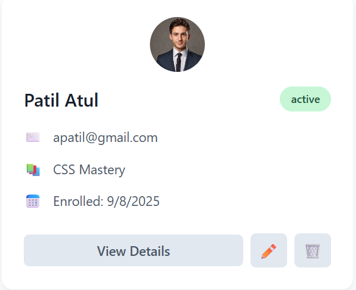

## Student Management Dashboard

Efficiently manage and track student data with this responsive React dashboard featuring search, add, edit, delete, and data persistence.

---

## Project Overview

This React-based dashboard simplifies student management by allowing you to:  
- View key statistics: total students, active students, and courses  
- Search students live by name, email, or course  
- Add, edit, and delete student entries with modals  
- View detailed student profiles  
- Persist data locally so changes survive page reloads  

## Architecture and Data Flow

The architecture is composed of modular React components with a central custom hook managing state and persistence:

- **useStudentManager hook**: Handles student data state and saves to `localStorage`. Provides add, update, delete methods.  
- **App**: Fetches course data, manages search/filter state, and controls modal visibility.  
- **StatsCards**: Displays total student statistics.  
- **SearchBar**: Search input and add student button.  
- **StudentList**: Renders student cards with actions to view, edit, or delete.  
- **StudentModal**: Modal form for adding/editing students with validation.  
- **StudentDetailsModal**: Presents read-only detailed student info with edit shortcut.  

Data flows top-down via props; interactions bubble up through callbacks to keep consistent state and persistence.

---

## Screenshot

### Add Student Form  

### Edit Student Form  

### Course List View  

### Student Details Modal  

## Project Structure

student-management-dashboard/
├── assets/
│ └── dashboard-screenshot.png
├── components/
│ ├── StatsCards.jsx
│ ├── SearchBar.jsx
│ ├── StudentList.jsx
│ ├── StudentCard.jsx
│ ├── StudentModal.jsx
│ └── StudentDetailsModal.jsx
├── hooks/
│ └── useStudentManager.js
├── services/
│ └── coursesService.js
├── App.jsx
├── App.css
└── README.md

text

---

## Getting Started

1. Clone the repo:  
git clone https://github.com/vaibhavipatil0241/Student-Management-Dashboard.git

2. Install dependencies:  
npm install

3. Run locally:  
npm start

4. Open [http://localhost:3000](http://localhost:3000) in your browser.

---

This concise README highlights the core features, architecture, and provides a single key screenshot for a clear project introduction.
