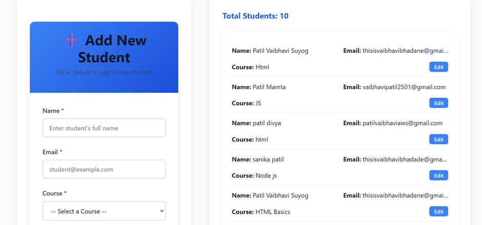

Student Management Dashboard

A React single-page application that allows adding, editing, and viewing students. Each student has a name, email, enrolled course, and profile image.

## Project Overview

## Architecture and Data Flow

## Features

- Add new students via a validated form
- List all students
- Edit existing student details
- Responsive, attractive UI for desktop and mobile
- Fetches courses list from mock API using async/await

## Installation

1. Clone the repository:
git clone https://github.com/vaibhavipatil0241/student-management-dashboard.git

2. Navigate into the project folder:
cd student-management-dashboard

3. Install dependencies:
npm install

4. Start the development server:
npm start

## Usage

1. Fill out the form on the left to add or edit student details.  
2. View and edit existing students in the table on the right.  
3. The UI adapts to mobile and desktop screens.

## Technologies

- React (Hooks, Functional Components)  
- CSS Grid and Flexbox for layout  
- Custom CSS for styling  
- Async/Await for API calls  

## Contributing

Feel free to submit issues or pull requests.

## License

MIT License
